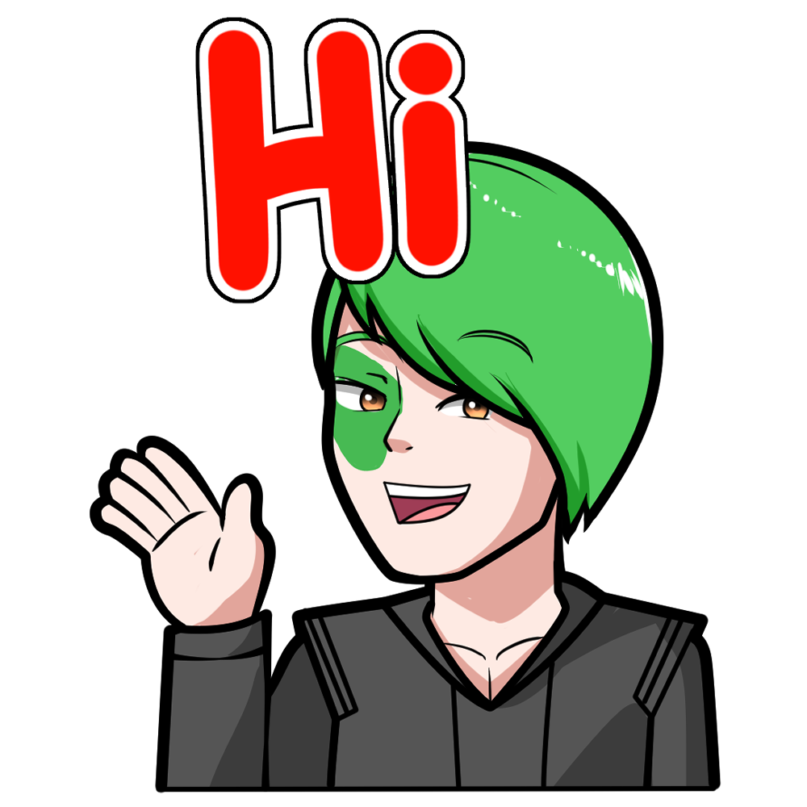

	
	

	

  		

  			
  		

  		

  			
  		

  		

  			
  		

	

<!-- - 👋 Hi, I’m @WittyAi-Artist
- 👀 I’m interested in ...
- 🌱 I’m currently learning ...
- 💞️ I’m looking to collaborate on ...
- 📫 How to reach me ...
 -->

<!---
WittyAi-Artist/WittyAi-Artist is a ✨ special ✨ repository because its `README.md` (this file) appears on your GitHub profile.
You can click the Preview link to take a look at your changes.
--->
